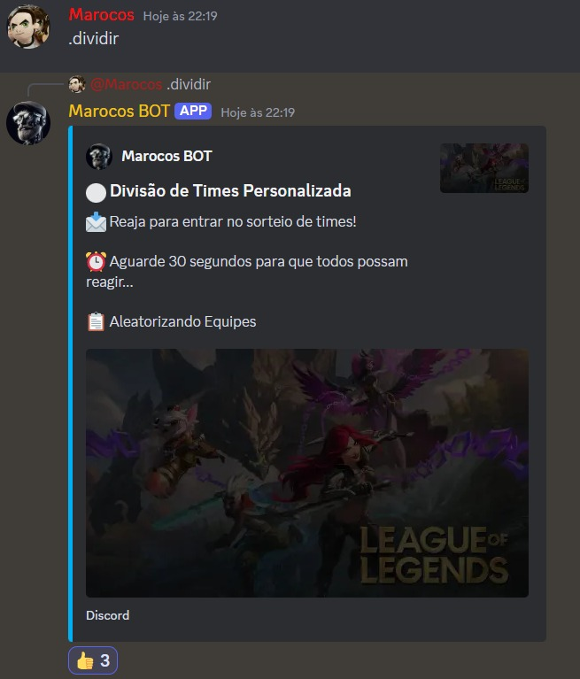
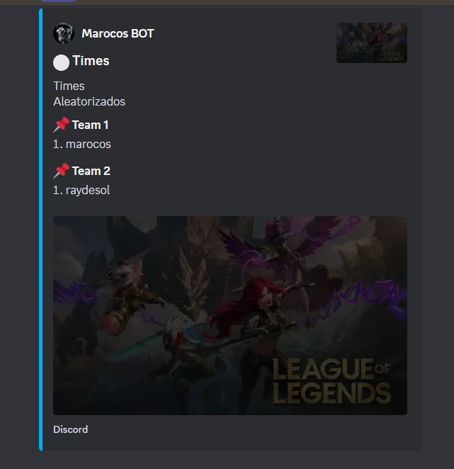
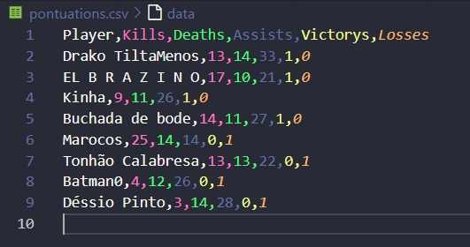
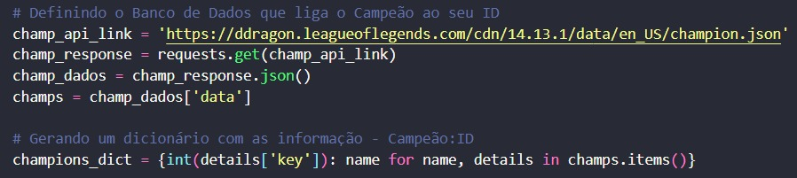

## Marocos Bot

## Objetivo:
Bot criado para desenvolvimento de algumas funcionalidades úteis para eu e meus amigos relacionado a jogos custons de league of legends, e league of legends no geral

## Integrações
- API Riot
- LCU Riot
- Discord.py e suas necessidades
- CSV

## Principais Funcionalidades
- ### Exibição do Perfil do Player com maestrias e elos
    

- ### Exibição de partida em andamento do Player
    

- ### Exibição da última partida do Player
    

- ### Divisão de times
    
    

## Funções específicas
Como o bot/aplicações foram criadas especificamente para nosso grupo de amizade, existe algumas funções "ao pé da letra" como a função de pontuar, função essa que também funciona para partidas normais do Player, mas nesse caso usamos para as partidas personalizadas que fazemos.
&nbsp;

É ai que entra o LCU (League Client Update), ele basicamente "loga" em sua conta riot, ou seja, você deve estar logado no client para utilizar suas funções, e então pegará os dados de suas partidas personalizadas (apenas as que você participou).
&nbsp;

E com as funções de integração ('pontuation_integrer' em 'backfunctions.py') que recebe um determinado tipo de lista de listas e integra nos arquivos CSV's, sendo o 'pontuations.csv' os dados requisitados e o 'matchesid.csv' como salvador das partidas já adicionadas.

&nbsp;

Além disso, existe algumas outras funções que servem toda a aplicação ao longo dos códigos

## Pequena explicação dos códigos

Primeiramente vou disponibilizar os links que mais utilizei para pesquisa:
- https://developer.riotgames.com/ (para a API Riot)
- https://lcu.vivide.re/ (para o LCU)
- https://discordpy.readthedocs.io/en/stable/ (para o Discord.py)

Inicialmente devemos adquirir os Tokens das API's de bot do discord e da riot e importar as devidas bibliotecas
&nbsp;

No Discord.py trabalhei com eventos e comandos, utilizando eles em conjunto com a API Riot, quando trabalhamos com API's no geral, é importante saber lidar com os requests, basicamente, utilizamos desses requests para pegarmos informações dos bancos de dados da API, como por exemplo aqui (Pego os campeões e seus devidos ID e gero um dicionário que vou utilizar depois ao longo do código)

&nbsp;

Em várias partes do projeto usaremos essa especíe de código para pegarmos os dados da API Riot, e então fazer as comparações e modificações de acordo com o seu objetivo, ao longo das linhas existe comentários falando o objetivo do código que você pode tomar como exemplo.
&nbsp;

Utilizei o LCU em outro arquivo devido a sincronização 'async' do LCU conflitar com o 'async' do discord.py, e então rodar separadamente como um subprocesso da forma que me for necessário.
&nbsp;

Mas no geral é isso, ao longo das aplicações você conseguirá entender melhor cada funcionalidade utilizada
&nbsp;

Pretendo adicionar mais funcionalidades que irei atualizando!!!